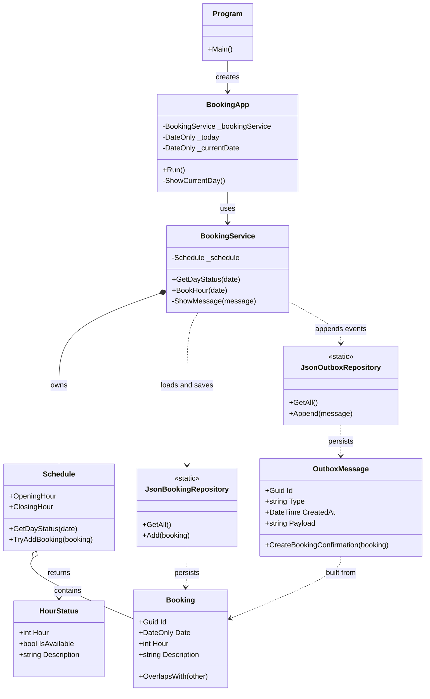

# SimpleBooking

SimpleBooking is a small .NET console application for viewing available booking hours, creating bookings, and writing booking confirmation requests to an outbox file.

The diagram below shows the current structure of the codebase as implemented today. It focuses on the main classes, their responsibilities, and how data and side effects move through the application.

## UML Class Diagram

## Architecture Notes

The application starts in `Program`, which creates `BookingApp`. `BookingApp` is the console-driven UI loop and delegates booking operations to `BookingService`.

`BookingService` coordinates the booking flow. It loads bookings from `JsonBookingRepository`, applies booking rules through `Schedule`, persists successful bookings back to the booking repository, and appends an `OutboxMessage` through `JsonOutboxRepository`.

The domain model lives in `Model`:

- `Schedule` contains booking rules and availability calculations.
- `Booking` represents a single reserved hour.
- `HourStatus` represents the availability of one hour slot.
- `OutboxMessage` represents an integration event written to the outbox file.

## Side Effects In The Current Design - Clean Core Refactor Opportunity

The current implementation mixes business logic and side effects in a few places:

- Console I/O happens in `BookingApp` and `BookingService`.
- File I/O happens in `JsonBookingRepository` and `JsonOutboxRepository`.
- System time is read directly when creating the schedule and when creating outbox messages.

That makes this structure a good candidate for a later clean-core refactor, but this README documents the current design as it exists now.

## High-Level Architecture After A Clean Core Refactor

After the refactor, the goal is to keep business rules in a side-effect free core and move all I/O to the edges.

- The core contains booking rules and use cases only (no Console, file system, or clock calls).
- The application layer depends on interfaces for persistence, time, and messaging.
- Infrastructure implements those interfaces (JSON now, database/API later).
- UI layers (console today, API/web later) call into the same application use cases.
- Dependency flow points inward: UI and infrastructure depend on application/core, never the other way around.

In practice, this makes the booking logic reusable in an API without copying logic out of the console app.

Recommended sequence:

- Step 1: Clean Core first. Extract side effects to the edges and make use cases reusable.
- Step 2: SOLID second. Tighten abstractions and responsibilities once the boundaries are clear.
- Dependency inversion is still introduced early where needed, but as an enabler for clean-core boundaries rather than as an isolated goal.

## Refactor Roadmap

| Step | Focus | Output | Document |
|---|---|---|---|
| 1 | Clean Core | Side effects moved to edges, reusable use cases | [docs/CleanCoreRefactorPlan.md](docs/CleanCoreRefactorPlan.md) |
| 2 | SOLID Hardening | Stronger responsibilities and abstractions | [docs/SolidHardeningPlan.md](docs/SolidHardeningPlan.md) |

## Recommended Next Step From Terje Specs

The selected text asks what makes reuse in an API difficult. The best next step is to prove reuse by extracting one API-ready use case in the clean-core phase:

1. Start with "Create booking" as an application use case that takes input values and returns a result object.
2. Keep Console read/write in `BookingApp`; do not call `Console` from `BookingService`.
3. Let `BookingService` depend on repository and clock interfaces so the same use case can later be called from API/web.

If this step is completed first, the same booking logic can be reused from Console today and from API/web later without duplication.

## Terje specs 

Applikasjonen er et veldig enkelt bookingsystem.

Tenk dere for eksempel:

et møterom

eller et bord på en restaurant

…som kan bookes på følgende måte:

Det finnes kun én ressurs

Åpningstid er 08–16 (timer 08–15 kan bookes)

Man booker hele timer

Man kan ikke booke i fortiden

Man kan kun booke fra og med dagen etter i dag

Hver booking består av:

dato

time

en enkel tekst (beskrivelse)

Applikasjonen lar deg:

bla mellom dager

se status for alle timer (ledig/opptatt)

legge inn en booking

Ved vellykket booking:

lagres den til en JSON-fil

det skrives også en melding til en “outbox” (simulering av f.eks. e-post)

Hva dere skal gjøre
Før møtet ønsker jeg at dere:

Kjører applikasjonen og blir kjent med funksjonaliteten

Leser gjennom koden

Prøver å forstå hvordan den er bygget opp

Og viktigst:

👉 Begynn å reflektere over:

Hva er det som ikke er så bra med denne koden?
Hva er det som skurrer litt?

Viktig presisering
Dette handler ikke primært om at koden ikke er perfekt objektorientert.

Koden er bevisst laget som:

ryddig

forståelig

ganske “normal”

Men det er noe mer grunnleggende som ikke er helt riktig.

Tenk spesielt på dette
Se for dere at vi på sikt skal:

bygge et API (backend)

lagre data i en database

lage en frontend (web)

👉 Spørsmålet er:

Hvordan måtte denne koden vært for at vi kunne gjenbruke logikken i et API?

Og dermed:

Hva er det i denne koden som gjør det vanskelig å gjenbruke den?